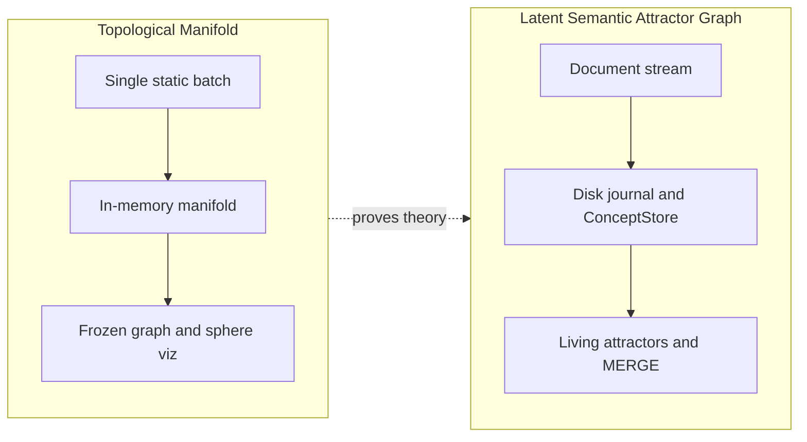
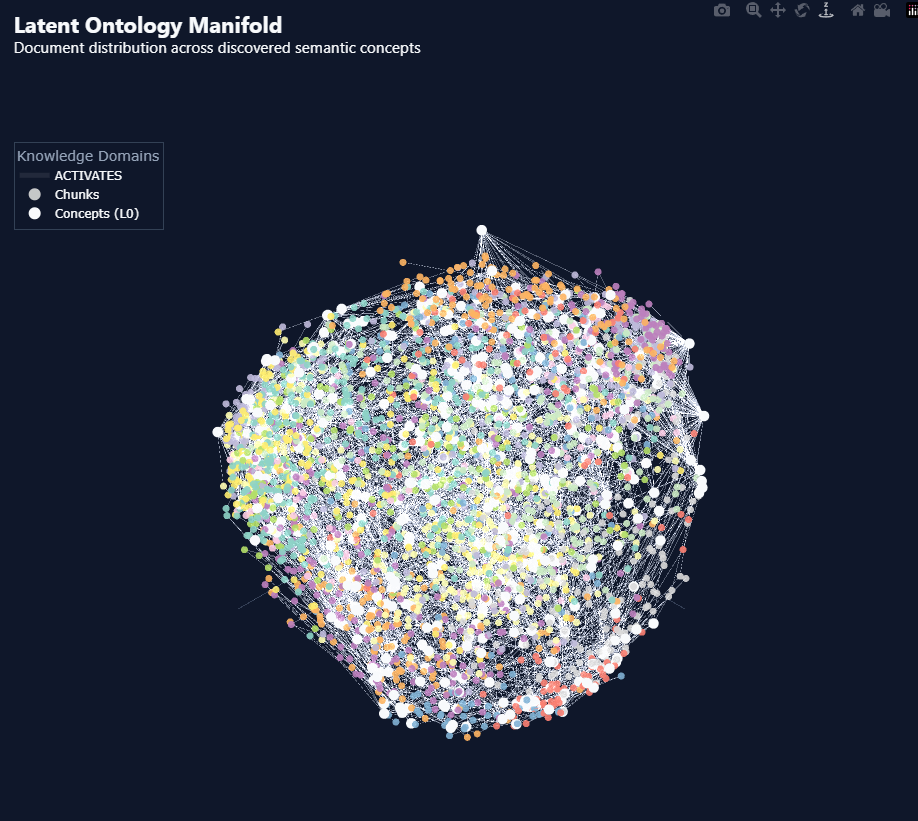
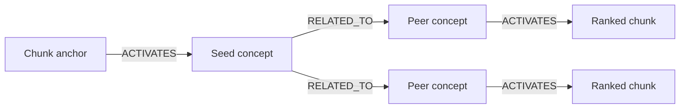

# proj_ontology

**Autonomous latent knowledge graphs from raw text** — no predefined categories, no manual labels.

This repository ships two complementary products that share embeddings and Cypher patterns but target different workloads:

| Product | Package | Manual | Best for |
|---------|---------|--------|----------|
| **v1 — Topological Manifold** | [`v1_single_pass/`](v1_single_pass/) | [`docs/v1-topological-manifold/`](docs/v1-topological-manifold/README.md) | Research — manifold, sphere |
| **v2 — Latent Semantic Attractor Graph** | [`v2_orchestrator/`](v2_orchestrator/) | [`docs/v2-latent-semantic-attractor-graph/`](docs/v2-latent-semantic-attractor-graph/README.md) | Production — streaming, RAG |

Documentation index: [`docs/README.md`](docs/README.md) · [Changelog](CHANGELOG.md)

---

## Requirements

| Component | Version |
|-----------|---------|
| Python | 3.10+ |
| Neo4j | 5.x (Bolt) |
| Disk | ~2 GB for embedding model cache (first run) |

```powershell
pip install -r requirements.txt
copy .env.sample .env    # set NEO4J_PASSWORD and WIKIPEDIA_USER_AGENT
```

---

## Two architectures

Two approaches share the embedding cache at [`models/`](models/) but differ in memory model, graph lifecycle, and Neo4j write strategy.



### Visual anchor

Shared Wikipedia topic list ([`corpus/wikipedia_topics.py`](corpus/wikipedia_topics.py)) — **v1 (POC) ingests the first 8 articles** for a fast in-memory run; **v2 (MVP) streams all 40** in batches. Sphere plots show **ACTIVATES** edges (chunk → concept) as faint white lines.

| **v1 — Topological Manifold (8 articles)** | **v2 — Latent Semantic Attractor Graph (40 articles)** |
|---------------------------------------------|--------------------------------------------------------|
|  |  |

Live copies: `v1_single_pass/data/visualisation/ontology_sphere.html` and `v2_orchestrator/data/visualisation/ontology_sphere.html` (v2: pass `--plot` or set `KEEP_VISUAL_ARTIFACTS=true`). Explore the Neo4j graph in [Browser](#neo4j-browser-symbolic-graph).

### Which product?

| | **v1 — Topological Manifold** | **v2 — Latent Semantic Attractor Graph** |
|---|-------------------------------|------------------------------------------|
| **Package** | [`v1_single_pass/`](v1_single_pass/) | [`v2_orchestrator/`](v2_orchestrator/) |
| **Manual** | [`docs/v1-topological-manifold/`](docs/v1-topological-manifold/README.md) | [`docs/v2-latent-semantic-attractor-graph/`](docs/v2-latent-semantic-attractor-graph/README.md) |
| **When to use** | Theory, sphere exploration | Production ingest, RAG |
| **Run model** | One shot, full corpus in RAM | Streaming batches; resume |
| **Concepts** | Frozen OMP atoms | EMA living attractors |
| **New data** | Full rebuild | Append batches |
| **Neo4j DB** | `ontologyv1` | `ontologyv2` |
| **Hierarchy** | Louvain L1 (`SUPER_CONCEPT_OF`) | L0 only |
| **`RELATED_TO`** | Top-k cosine per concept | Mutual k-NN |
| **Wikipedia** | First **8** topics (subset; cached on disk) | Full **40** topics (live fetch per batch) |
| **Sphere viz** | `python -m v1_single_pass.visualisation.plot_ontology_sphere` | `--plot` → shared sphere script |

v1 proves manifold discretization (design framing: SVD → TwoNN → Diffusion → OMP → Kepler Mapper; [implementation mapping](docs/v1-topological-manifold/mathematical-foundations.md#implementation-mapping)). v2 streams living attractors with disk journal and MERGE upserts — [data-flow](docs/v2-latent-semantic-attractor-graph/data-flow.md).

---

## Quick start

```cypher
CREATE DATABASE ontologyv1 IF NOT EXISTS;
CREATE DATABASE ontologyv2 IF NOT EXISTS;
```

> **Note:** Neo4j rejects underscores in database names on some editions — use `ontologyv1` / `ontologyv2`, not `ontology_v1`.

### A — v1 Topological Manifold

```powershell
$env:NEO4J_DATABASE='ontologyv1'
$env:KEEP_VISUAL_ARTIFACTS='true'
python -m v1_single_pass.main
python -m v1_single_pass.visualisation.plot_ontology_sphere `
  -o v1_single_pass/data/visualisation/ontology_sphere.html
```

Details: [v1 operations — Run locally](docs/v1-topological-manifold/operations.md#run-locally)

### B — v2 Latent Semantic Attractor Graph

```powershell
$env:NEO4J_DATABASE='ontologyv2'
$env:KEEP_VISUAL_ARTIFACTS='true'
python -m v2_orchestrator.main --reset --max-batches 8 --articles-per-batch 5 --plot   # full 40-article corpus
python -m v2_orchestrator.tests.verify_smoke
python -m v2_orchestrator.tests.verify_neo4j
```

Resume: `python -m v2_orchestrator.main` · Details: [operations.md](docs/v2-latent-semantic-attractor-graph/operations.md)

---

## Explore the graph interactively

After a pipeline run you can inspect the ontology in two ways — no extra setup beyond the quick starts above.

### 3D semantic sphere (browser)

Both products export a **prosphera** HTML visualisation: chunks and concept attractors on the unit hypersphere, with optional **ACTIVATES** edges (chunk → concept).

| Product | Open in your browser |
|---------|----------------------|
| **v1** | `v1_single_pass/data/visualisation/ontology_sphere.html` |
| **v2** | `v2_orchestrator/data/visualisation/ontology_sphere.html` (written when you pass `--plot` or set `KEEP_VISUAL_ARTIFACTS=true`) |

**What you can do:** rotate and zoom the 3D view; hover nodes for source document, chunk text preview, and concept density; trace how text chunks attach to latent attractors on the manifold.

v1 also supports a standalone export:

```powershell
python -m v1_single_pass.visualisation.plot_ontology_sphere `
  -o v1_single_pass/data/visualisation/ontology_sphere.html
```

Use `--draw-edges` if ACTIVATES lines are hidden on large corpora (see `DRAW_EDGES` in [`.env.sample`](.env.sample)).

### Neo4j Browser (symbolic graph)

Publish loads the same graph into Neo4j for **relationship traversal** and Cypher queries.

1. Open [Neo4j Browser](https://neo4j.com/docs/browser-manual/) (or Desktop).
2. Select the database you loaded: `:use ontologyv1` or `:use ontologyv2`.
3. Explore visually — e.g. `MATCH (c:Chunk)-[:ACTIVATES]->(n:Concept) RETURN c,n LIMIT 50` — or run the saved queries in [`docs/cypher/queries/`](docs/cypher/queries/README.md).

For production-style retrieval (anchor chunks → concepts → peer neighborhood → ranked context), see [RAG & graph traversal](#rag--graph-traversal) below.

---

## Verification

| Check | Command |
|-------|---------|
| v2 offline smoke | `python -m v2_orchestrator.tests.verify_smoke` |
| v2 Neo4j E2E | `python -m v2_orchestrator.tests.verify_neo4j` |
| v2 backfill Neo4j from disk | `python -m v2_orchestrator.tests.verify_neo4j --sync` |
| v1 publish check | Quick start A, then query chunks/concepts in Neo4j Browser |

---

## Documentation

| Document | Role |
|----------|------|
| [`docs/README.md`](docs/README.md) | **Docs index** — where to find each topic |
| [`docs/v1-topological-manifold/`](docs/v1-topological-manifold/README.md) | v1 theory, schema, operations |
| [`docs/v2-latent-semantic-attractor-graph/`](docs/v2-latent-semantic-attractor-graph/README.md) | v2 data flow, tuning, operations |
| [`v1_single_pass/README.md`](v1_single_pass/README.md) · [`v2_orchestrator/README.md`](v2_orchestrator/README.md) | Package entry points |
| **This README — [RAG](#rag--graph-traversal)** | Full `rag_subgraph.cypher` (canonical) |
| [`docs/cypher/queries/`](docs/cypher/queries/README.md) | Saved `.cypher` files |
| [`.env.sample`](.env.sample) · [`CHANGELOG.md`](CHANGELOG.md) | Config defaults · release history |

---

## Mental model

1. **Chunks** → 384-D embeddings (`paraphrase-multilingual-MiniLM-L12-v2`), centered on a unit hypersphere.
2. **Concepts** discretize the manifold — frozen OMP atoms (v1) or EMA attractors (v2).
3. **Edges:** `ACTIVATES` (chunk → concept), `RELATED_TO` (concept ↔ concept). v1 adds `SUPER_CONCEPT_OF` (L1).
4. **Neo4j** enables RAG traversal — wipe/reload (v1) or MERGE upserts (v2).

---

## Code entry points

| v1 | v2 |
|----|-----|
| `python -m v1_single_pass.main` | `python -m v2_orchestrator.main` |
| [`ontology/pipeline.py`](v1_single_pass/ontology/pipeline.py) | [`storage.py`](v2_orchestrator/storage.py) · [`ontology_engine.py`](v2_orchestrator/ontology_engine.py) |

Module maps: [v1 operations](docs/v1-topological-manifold/operations.md#read-the-code) · [v2 operations](docs/v2-latent-semantic-attractor-graph/operations.md#read-the-code).

**Corpus:** [`corpus/wikipedia_topics.py`](corpus/wikipedia_topics.py) defines **40** topics. **v1 (POC)** uses the first **8** (`WIKIPEDIA_TOPICS[:8]` in [`pipeline.py`](v1_single_pass/ontology/pipeline.py)); **v2 (MVP)** ingests the full list via streaming batches.

---

## Configuration

Knobs in [`.env.sample`](.env.sample). Set `NEO4J_DATABASE` before each run.

| Scope | Where to read |
|-------|---------------|
| Shared (embeddings, OMP, chunks) | [`.env.sample`](.env.sample) |
| v1 (Louvain, artifacts) | [v1 operations](docs/v1-topological-manifold/operations.md) |
| v2 (EMA, orphans, batches) | [v2 configuration](docs/v2-latent-semantic-attractor-graph/configuration.md) |

**v2 CLI:** `--reset` · `--max-batches N` · `--articles-per-batch N` · `--plot` · `--draw-edges` / `--no-draw-edges`

---

## Neo4j schema (summary)

| Node | Topological Manifold | Latent Semantic Attractor Graph |
|------|----------------------|----------------------------------|
| `Chunk` | Text leaves | Text leaves |
| `Concept` L0 | OMP + `density` | Attractors + `chunk_count` |
| `Concept` L1 | Louvain (`SUPER_CONCEPT_OF`) | — |

`SUPER_CONCEPT_OF` is **Topological Manifold only**.

---

## RAG & graph traversal

Both products build the same **concept-anchored** structure for retrieval: text chunks activate semantic attractors (`ACTIVATES`), and attractors link laterally (`RELATED_TO`). RAG does not search raw embeddings in Neo4j — it **anchors on chunk ids**, walks the symbolic graph, and ranks peer chunks by shared concept coverage.



**Traversal pattern:** `Chunk` → `ACTIVATES` → `Concept` → `RELATED_TO` (0–3 hops) → peer `Concept` → `ACTIVATES` ← `Chunk`

| Step | What you do |
|------|-------------|
| 1. Load a graph | `NEO4J_DATABASE=ontologyv2 python -m v2_orchestrator.main` (or `NEO4J_DATABASE=ontologyv1 python -m v1_single_pass.main` for Topological Manifold) |
| 2. Pick seed chunk ids | From your user query, retrieved hits, or exploration — list ids in Browser (query below) |
| 3. Run subgraph query | [`rag_subgraph.cypher`](docs/cypher/queries/rag_subgraph.cypher) below — returns concepts, lateral edges, and top coverage chunks for prompt context |
| 4. Assemble context | `RETURN` rows give `chunk.text` + the concept neighborhood that justified the match |

**Pick real ids** after any ingest (`:use ontologyv2`):

```cypher
MATCH (c:Chunk)
RETURN c.id, left(c.text, 80) AS preview
ORDER BY c.id
LIMIT 20;
```

Example seeds from a live graph: **`[0, 1, 2]`** — update `WHERE seed_chunk.id IN [...]` to match your anchors.

### Production RAG query — `rag_subgraph.cypher`

This is the **full multi-phase query** (Neo4j 5+). It: (0) maps seed chunks → concepts, (1) expands the manifold, (2) drops hub concepts, (3) ranks chunks by concept coverage, (4) returns lateral `RELATED_TO` topology, (5) assembles chunk + concept subgraph for visualization or context packing.

Saved copy: [`docs/cypher/queries/rag_subgraph.cypher`](docs/cypher/queries/rag_subgraph.cypher)

```cypher
// RAG subgraph — multi-hop manifold + coverage-ranked chunks
// Requires Neo4j 5+ (CALL subqueries with imported variables). Tune entry chunk ids.

// 0. Anchor Phase: Translate chunk IDs into stable Seed Concepts
MATCH (seed_chunk:Chunk)-[:ACTIVATES]->(seed_concept:Concept)
WHERE seed_chunk.id IN [0, 1, 2]
WITH DISTINCT seed_concept

// 1. Expand Phase: Traverse the manifold from the Seed Concepts
MATCH (seed_concept)-[:RELATED_TO*0..3]-(n:Concept)
WITH DISTINCT n

// 2. Filter Phase: Drop massive hubs to keep context focused
WHERE count { (n)-[:RELATED_TO]-() } <= 10
WITH collect(n) AS filtered_concepts

// 3. RAG Selection: Highest-coverage chunks in the concept neighborhood
CALL (filtered_concepts) {
    UNWIND filtered_concepts AS n
    MATCH (chunk:Chunk)-[:ACTIVATES]->(n)
    WITH chunk, count(DISTINCT n) AS coverage
    ORDER BY coverage DESC, coalesce(size(chunk.text), 0) DESC
    RETURN collect(DISTINCT chunk)[0..10] AS selected_chunks
}

// 4. Graph Topology: Lateral edges among filtered concepts
CALL (filtered_concepts) {
    UNWIND filtered_concepts AS n
    MATCH (n)-[relation:RELATED_TO]-(peer:Concept)
    WHERE peer IN filtered_concepts
    RETURN DISTINCT n, relation, peer
}

// 5. Final Assembly: Attach ranked RAG chunks to the concept graph
WITH n, relation, peer, selected_chunks
UNWIND selected_chunks AS chunk
MATCH (chunk)-[activation:ACTIVATES]->(n)

RETURN DISTINCT n, relation, peer, chunk, activation
LIMIT 500
```

**Using the result:** each `chunk` row is a candidate context passage; `coverage` is implicit in selection order (step 3). `n`, `relation`, and `peer` define the **explainable** concept neighborhood — useful for GraphRAG-style citations (“retrieved because shared concept X with your anchor”).

Shorter building blocks: [saved queries](docs/cypher/queries/README.md) (`lookup_chunks_by_id`, `local_traversal`).

---

## Repository layout

See [`docs/README.md`](docs/README.md) for the full tree. In short: **`docs/`** holds v1/v2 manuals, **`v1_single_pass/`** and **`v2_orchestrator/`** hold runnable code, **`corpus/`** holds the shared 40-topic Wikipedia list (v1 uses 8, v2 uses all 40).
