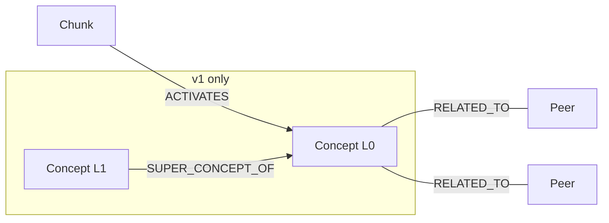
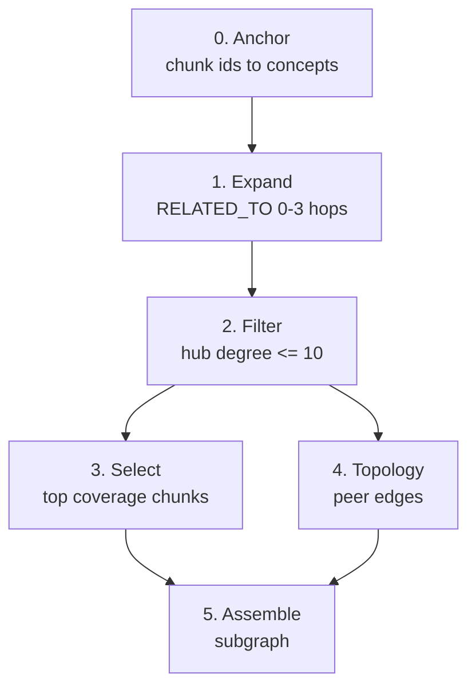

# Shared Neo4j exploration queries

Run in **Neo4j Browser** or `cypher-shell` after loading a graph from either pipeline.

**Related:** [docs index](../../README.md) · [RAG walkthrough (canonical)](../../../README.md#rag--graph-traversal)

---

## Graph model



Traversal pattern: **chunk ids → seed concepts → peer neighborhood → ranked chunks**.

---

## Load a graph first

| Product | Neo4j DB | How |
|---------|----------|-----|
| v1 Topological Manifold | `ontologyv1` | [v1 operations](../../v1-topological-manifold/operations.md#run-locally) |
| v2 Latent Semantic Attractor Graph | `ontologyv2` | [v2 operations](../../v2-latent-semantic-attractor-graph/operations.md#run-locally) |

In Browser: `:use ontologyv1` or `:use ontologyv2`.

---

## Query files

| File | Purpose |
|------|---------|
| [`lookup_chunks_by_id.cypher`](lookup_chunks_by_id.cypher) | Return chunks for given ids |
| [`local_traversal.cypher`](local_traversal.cypher) | Chunk → concepts → `RELATED_TO` peers (1–2 hops) |
| [`rag_subgraph.cypher`](rag_subgraph.cypher) | Full RAG subgraph — hub filter + coverage-ranked chunks (**Neo4j 5+**) |

The **full production query** with inline commentary lives in the [root README](../../../README.md#production-rag-query--rag_subgraphcypher).

### `rag_subgraph.cypher` phases



---

## Pick chunk ids

After ingest, list ids in Browser (example seeds: `[0, 1, 2]`):

---

## Smoke query

```cypher
MATCH (c:Chunk) WITH count(c) AS chunks
MATCH (n:Concept) WITH chunks, count(n) AS concepts
MATCH ()-[r:ACTIVATES]->() WITH chunks, concepts, count(r) AS activates
RETURN chunks, concepts, activates;
```

Expect `activates` > 0 and `concepts` << `chunks`.
