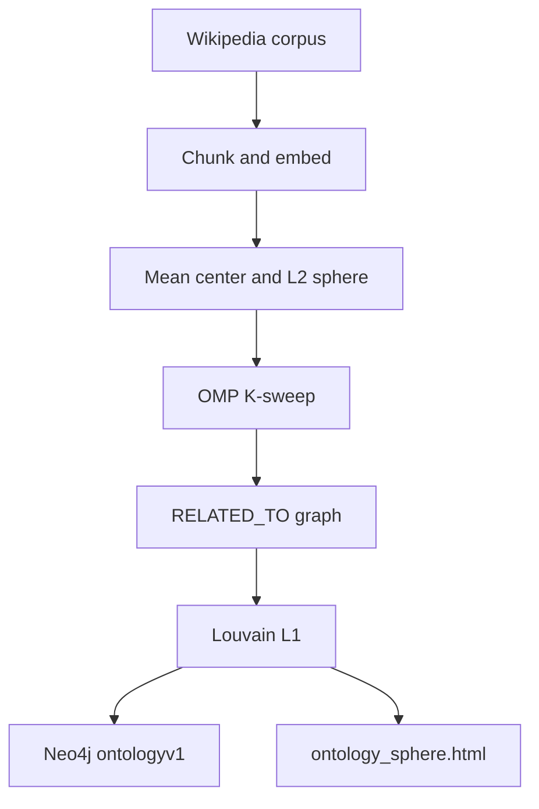

# v1 — Topological Manifold

**Package:** [`v1_single_pass/`](../../v1_single_pass/) · **Runbook:** [operations.md](operations.md)

Research proof of concept: derive a discrete symbolic graph from a continuous semantic manifold — no predefined categories, no manual labels. One static in-memory batch → Louvain L1 hierarchy → sphere HTML + Neo4j (`ontologyv1`).

> **Corpus:** **8** Wikipedia articles — first topics from the shared 40-item list ([`corpus/wikipedia_topics.py`](../../corpus/wikipedia_topics.py)); see [operations — Corpus](operations.md#corpus).

> **Production / streaming?** Use [v2 — Latent Semantic Attractor Graph](../v2-latent-semantic-attractor-graph/README.md).
> **Choosing between v1 and v2?** See [root README — Two architectures](../../README.md#two-architectures).

**Entry:** `python -m v1_single_pass.main`

---

## Documentation map

| Topic | Document |
|-------|----------|
| Mathematical foundations (5-stage pipeline) | [mathematical-foundations.md](mathematical-foundations.md) |
| Graph shape & Neo4j schema | [graph-schema.md](graph-schema.md) |
| Run, verify, on-disk layout | [operations.md](operations.md) |
| Why v2 exists | [limitations.md](limitations.md) |
| Quick start & interactive viz | [Root README](../../README.md#quick-start) · [Explore the graph](../../README.md#explore-the-graph-interactively) |
| RAG & Cypher | [Root README — RAG](../../README.md#rag--graph-traversal) · [Cypher library](../cypher/queries/) |
| Configuration | [`.env.sample`](../../.env.sample) |

---

## Pipeline at a glance

**Design framing:** SVD → TwoNN → Diffusion maps → OMP → Kepler Mapper
**Implementation:** mean-centering + OMP K-sweep + top-k `RELATED_TO` + Louvain + prosphera sphere — [implementation mapping](mathematical-foundations.md#implementation-mapping)

After a run, open [`v1_single_pass/data/visualisation/ontology_sphere.html`](../../v1_single_pass/data/visualisation/ontology_sphere.html) in a browser — see [operations — Run locally](operations.md#run-locally).

