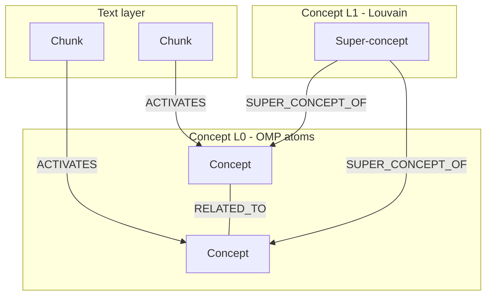

# v1 — Graph shape & Neo4j schema

## Symbolic graph (L0 + L1)

## Neo4j schema (v1 only)

| Node | Represents | Key edges |
|------|------------|-----------|
| `Chunk` | Text leaf | `-[:ACTIVATES]->` Concept |
| `Concept` **(L0)** | OMP dictionary atom | `-[:RELATED_TO]-` peers |
| `Concept` **(L1)** | Louvain super-concept | `-[:SUPER_CONCEPT_OF]->` L0 |

L0 concepts carry `density` (activation count). **v2** uses L0-only concepts with `chunk_count` instead of L1 hierarchy.

## RAG traversal

v1 and v2 share `Chunk` → `ACTIVATES` → `Concept` → `RELATED_TO` traversal. Hub filter and multi-seed queries work on both graphs — see [Root README — RAG](../../README.md#rag--graph-traversal) and [`docs/cypher/queries/`](../cypher/queries/README.md).

**Manual index:** [README.md](README.md)
