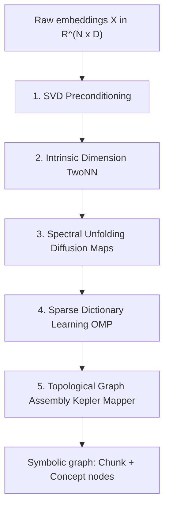
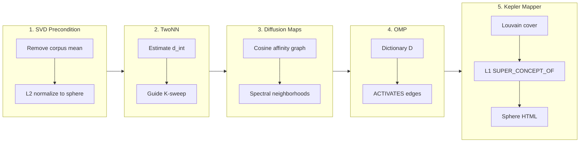

# v1 — Mathematical foundations

The **Topological Manifold** implements a **five-stage manifold-to-graph pipeline**. Starting from raw text, we obtain an embedding matrix $`X \in \mathbb{R}^{N \times D}`$ ($N$ chunks, $D$ dimensions) and progressively reduce, unfold, sparsify, and discretize it into a traversable ontology.



## Implementation mapping

Stages 2–3 and 5 name the *target* topological pipeline. The runnable code in [`pipeline.py`](../../v1_single_pass/ontology/pipeline.py) implements a lighter sklearn + NetworkX + prosphera stack that preserves the same graph shape:

| Stage | Theory (sections below) | Code |
|-------|-------------------------|------|
| 1 SVD precondition | Mean removal + L2 normalize | `embed_chunks()` |
| 2 TwoNN | Intrinsic dimension $`d_{\mathrm{int}}`$ | **Analogue** — OMP K-sweep with dead-atom penalty (no TwoNN estimator) |
| 3 Diffusion maps | Spectral unfolding | **Analogue** — top-k cosine `RELATED_TO` (not a diffusion operator) |
| 4 OMP | Sparse dictionary learning | `MiniBatchDictionaryLearning(transform_algorithm="omp")` |
| 5 Kepler Mapper | Topological cover + nerve | **Analogue** — Louvain on concept graph + `prosphera` sphere plot |

The Latent Semantic Attractor Graph (v2) reuses OMP + cosine geometry but adds streaming EMA centroids and **mutual** k-NN `RELATED_TO` — see [`calculate_knn_topology()`](../../v2_orchestrator/ontology_engine.py).

---

## 1. SVD preconditioning (anisotropy removal)

High-dimensional text embeddings exhibit **anisotropy**: a dominant shared direction (the “corpus mean”) collapses variance and distorts cosine geometry. We precondition via centering and spherical normalization:

```math
\tilde{x}_i = \frac{x_i - \mu}{\|x_i - \mu\|_2}, \quad \mu = \frac{1}{N}\sum_{i=1}^{N} x_i
```

This is equivalent to projecting onto the unit hypersphere after removing the first-order spectral bias — the dominant singular direction of the uncorrected matrix. All subsequent geometry (similarity, diffusion, sparse coding) operates on $`\tilde{X}`$, where geodesic intuition matches semantic relatedness more faithfully.

**Code:** `embed_chunks()` in [`pipeline.py`](../../v1_single_pass/ontology/pipeline.py).

---

## 2. Intrinsic dimensionality estimation (TwoNN)

Before committing to a dictionary size $K$, we need the **intrinsic dimension** $`d_{\mathrm{int}}`$ of the semantic manifold — the number of degrees of freedom actually occupied by data, not the ambient embedding dimension $D$.

The **Two Nearest Neighbors (TwoNN)** method estimates $`d_{\mathrm{int}}`$ from the ratio of first-to-second neighbor distances on the preconditioned point cloud. Intuitively: on a $d$-dimensional manifold, the volume of a small ball scales as $`r^d`$, so the cumulative distribution of distance ratios $`\mu_{i,2}/\mu_{i,1}`$ reveals $`d_{\mathrm{int}}`$ at the knee of its log–log plot.

In the POC, this informs the **OMP K-sweep** (20…200): we search for a dictionary size where reconstruction error plateaus without spawning dead atoms — a practical proxy for discretizing the manifold at its effective dimension. There is **no standalone TwoNN estimator** in the codebase; the K-sweep plays that role.

**Code:** K-sweep loop with dead-concept penalties in `build_ontology_graph()`.

---

## 3. Spectral unfolding (diffusion maps)

Raw cosine similarity on the sphere captures **local** structure but can obscure **global** manifold topology. **Diffusion Maps** construct a diffusion operator on a kernel graph:

```math
W_{ij} = \exp\!\left(-\frac{\|\tilde{x}_i - \tilde{x}_j\|^2}{2\sigma^2}\right), \quad P = D^{-1} W
```

Eigenvectors of $P$ at decreasing eigenvalues provide coordinates that unfold the manifold — separating branches and holes that cosine alone may conflate. In the POC, the **cosine `RELATED_TO` graph** and subsequent community structure approximate this spectral geometry: peer edges encode local diffusion neighborhoods; multi-hop traversal in Neo4j recovers unfolded connectivity.

**Code:** `RELATED_TO` top-$k$ cosine wiring in `build_ontology_graph()`.

---

## 4. Sparse dictionary learning (OMP)

With the manifold preconditioned and its effective dimension bounded, we **discretize** it into concept atoms via sparse coding. Given dictionary $`D \in \mathbb{R}^{K \times D}`$ with unit-norm rows, each chunk $`\tilde{x}_i`$ is encoded as:

```math
\min_{\alpha_i} \|\tilde{x}_i - \alpha_i D\|_2^2 \quad \text{s.t.} \quad \|\alpha_i\|_0 \leq s
```

**Orthogonal Matching Pursuit (OMP)** greedily selects at most $s =$ `CONCEPTS_PER_CHUNK` atoms per chunk. The resulting coefficients define **`ACTIVATES`** edges (chunk → concept). Dictionary rows are **concept attractors** — directions on the sphere that best reconstruct the corpus under sparsity.

**Code:** `MiniBatchDictionaryLearning(transform_algorithm="omp")`.

---

## 5. Topological graph assembly (Kepler Mapper)

**Kepler Mapper** turns a point cloud + lens function + cover into a **simplicial complex** — a topological skeleton of the manifold. Our POC analogue:

| Mapper ingredient | POC realization |
|-------------------|-----------------|
| **Lens** | OMP concept activation / cosine coordinates on $`S^{D-1}`$ |
| **Cover** | Overlapping neighborhoods via `RELATED_TO` peer clusters |
| **Nerve / clustering** | Louvain community detection on the concept graph |
| **Visualization** | 3D sphere projection (`prosphera`) → `ontology_sphere.html` |

Louvain partitions L0 concepts into L1 **super-concepts** (`SUPER_CONCEPT_OF`), yielding a two-level topological summary: local attractors (L0) and mesoscale communities (L1).

**Code:** Louvain in `build_ontology_graph()`; sphere plot in [`plot_ontology_sphere.py`](../../v1_single_pass/visualisation/plot_ontology_sphere.py).

---

## End-to-end summary



**Manual index:** [README.md](README.md)
