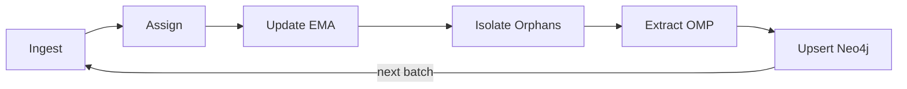

# v2 — Latent Semantic Attractor Graph

**Package:** [`v2_orchestrator/`](../../v2_orchestrator/) · **Runbook:** [operations.md](operations.md)

Streaming product: **living concept centroids** on a unit hypersphere, updated batch-by-batch, persisted with MERGE-only Neo4j upserts (`ontologyv2`).

> **Corpus:** **40** Wikipedia articles — full shared list in [`corpus/wikipedia_topics.py`](../../corpus/wikipedia_topics.py); see [operations — Corpus](operations.md#corpus).

> **Research / manifold theory?** See [v1 — Topological Manifold](../v1-topological-manifold/README.md).
> **Choosing between v1 and v2?** See [root README — Two architectures](../../README.md#two-architectures).

**Entry:** `python -m v2_orchestrator.main`

---

## Documentation map

| Topic | Document |
|-------|----------|
| Data flow (Ingest → Assign → EMA → Orphans → OMP → Upsert) | [data-flow.md](data-flow.md) |
| Concept inertia (EMA & decaying learning rate) | [concept-inertia.md](concept-inertia.md) |
| Environment variables & tuning | [configuration.md](configuration.md) |
| Run, verify, on-disk layout, `metrics.csv` | [operations.md](operations.md) |
| Quick start & verification | [Root README](../../README.md#quick-start) |
| RAG & Cypher | [Root README — RAG](../../README.md#rag--graph-traversal) · [Cypher library](../cypher/queries/) |
| Why v2 replaced v1 | [v1 limitations](../v1-topological-manifold/limitations.md) · [ADR 001](../architecture-decisions/001-streaming-migration.md) |
| Configuration defaults | [`.env.sample`](../../.env.sample) |

---

## Pipeline at a glance

**Ingest → Assign → Update (EMA) → Isolate (Orphans) → Extract (OMP) → Upsert (Neo4j)**

Concepts are **evolving semantic attractors** — OMP seeds new ones; [concept inertia](concept-inertia.md) slows mature centroids. Details: [data-flow.md](data-flow.md).

