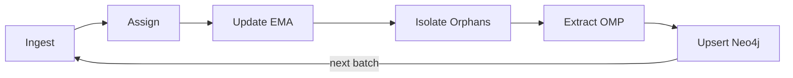
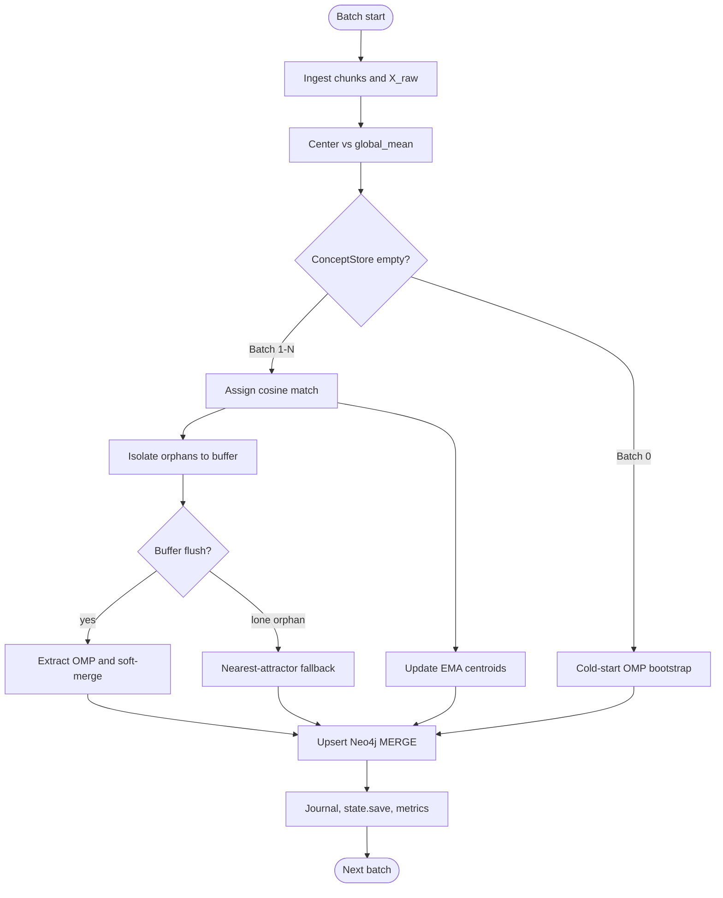
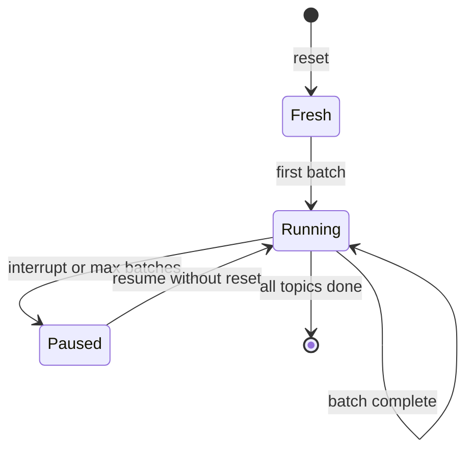

# v2 — Data flow lifecycle

The Latent Semantic Attractor Graph is a **continuous loop**: every batch ingests new text, attaches it to the living ontology, persists state to disk, and MERGE-upserts into Neo4j.

**Ingest → Assign → Update (EMA) → Isolate (Orphans) → Extract (OMP) → Upsert (Neo4j)**

Then the loop repeats until the corpus is exhausted or you interrupt. Resume without `--reset` from `processed_topic_offset`.

## Stage-by-stage

| Stage | What happens | Code |
|-------|----------------|------|
| **Ingest** | Next `ARTICLES_PER_BATCH` Wikipedia titles → chunks → raw embeddings `X_raw` (uncentered). | [`ingest.py`](../../v2_orchestrator/ingest.py) `ingest_batch()` |
| **Assign** | Center `X_raw` against running `global_mean`. Cosine-match each chunk to live centroids; scores ≥ adaptive threshold win (up to `TOP_K_ASSIGN`). | [`ontology_engine.py`](../../v2_orchestrator/ontology_engine.py) `assign_and_update()` |
| **Update (EMA)** | Each matched chunk nudges its concept centroid via exponential moving average. **Concept inertia** dampens the step as mass accumulates. | [`storage.py`](../../v2_orchestrator/storage.py) `update_concept_centroid()` |
| **Isolate (Orphans)** | Chunks below threshold enter the orphan buffer — no `ACTIVATES` edge yet. | `assign_and_update()` → `push_orphans()` |
| **Extract (OMP)** | When buffer is full (60 chunks) or **partial flush** (≥2 batch orphans): OMP mints new unit-norm attractors; optional soft-merge absorbs near-duplicates. | `extract_orphans_omp()`, `soft_merge_orphans()` |
| **Upsert (Neo4j)** | MERGE chunks, dirty concepts, `ACTIVATES`, mutual k-NN `RELATED_TO`. Append journal; save `ConceptStore`; increment `processed_topic_offset`. | [`neo4j_uploader.py`](../../v2_orchestrator/neo4j_uploader.py), [`main.py`](../../v2_orchestrator/main.py) `run_batch()` |

**Batch 0** (empty store): cold-start OMP bootstraps initial attractors — Assign/Update/Isolate/Extract collapse into a single OMP pass over the full batch.

## Resume model

**Package entry:** `python -m v2_orchestrator.main` · **Manual index:** [README.md](README.md)
